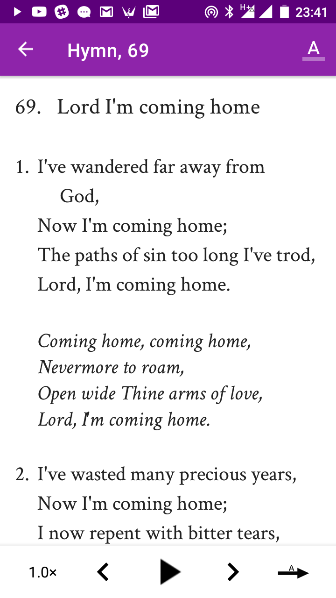
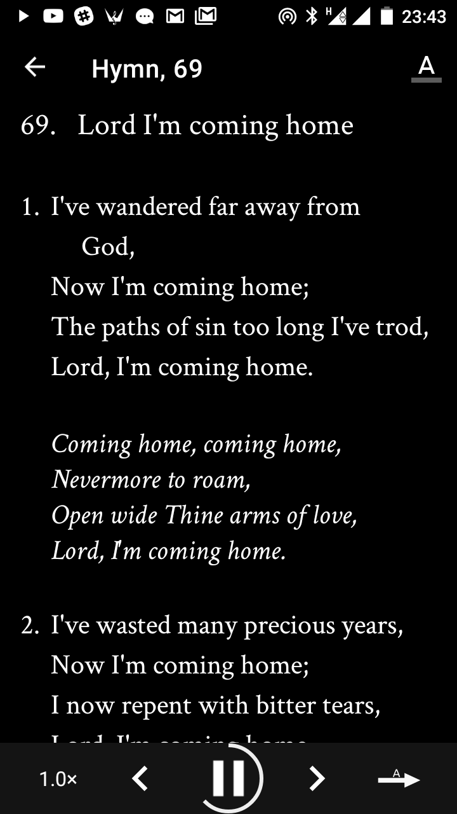
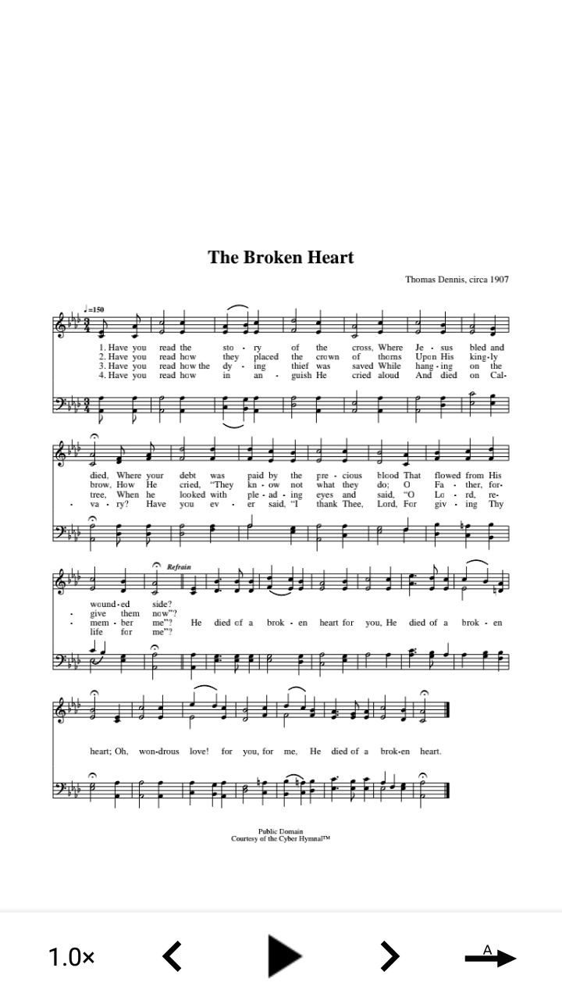

### Hymnbook (Watchman Hymnbook)
*The Watchman Hymnbook is a collection of 300 selected Hymns and Songs for Christian Fellowship as found in the Hymnal of The Watchman Catholic Charismatic Renewal Movement (WCCRM). The Watchman Hymnbook app contains above 250 midi tunes which will help anyone sing along easily.*

The very first app idea that brought me into Android development.  
###NOTE: The project is currently undergoing a ground up rebuild using latest technologies. *Look in the [version-2](tree/version-2) branch*

### Features
* Hymn listing and viewing of nicely formatted hymn details
* Playback midi tunes for each hymn
* Sheet music viewing for many of the hymns
* Music player implemented using background service
* TODO: Add other children themed hymns
* TODO: Browse other hymns apart from those provided in the church hymnal. Hymns will be provided through firebase. Backend for adding and updating hymns.
* TODO: Daily hymn notifications

### Installing
Download from Google [Play Store](https://play.google.com/store/apps/details?id=com.techbeloved.hymnbook).

Or if you want to build the project on your machine.

* Create a firebase project, add your sha-1 key to firebase and download the google-services.json file and place in the app directory.
* You may want to provide some default hymns as asset so the database is prepopulated at install. Or just customise the app to download files from your firebase database.

#### Preload the app with some hymn data
To achieve this, take a look at the [sample_hymns.json](app/src/main/assets/sample_hymns.json) file. 

* Your hymn files should follow the same format
* You can add multiple files. Your file names must have "*hymns*" in it and must be a json file
* You should add topics as well following same pattern as in [all_topics.json](app/src/main/assets/all_topics.json) sample. Your hymns topics must correspond to the topics you have here.

### Built With
Some of the technologies used in this app include

* Some UI architecture - MVVM-ish in this case
* Reactive programming - [RxJava](https://github.com/ReactiveX/RxJava)
* Android Architecture Components - [androidx libs](https://developer.android.com/jetpack/androidx/), LiveData, ViewModel, Room, WorkManager, NavigationComponent etc
* Language - [Kotlin](https://github.com/JetBrains/kotlin)
* [PDFViewer](https://github.com/barteksc/AndroidPdfViewer)
* Google Firebase Firestore, Firebase Storage

### Screenshots

#### Sheet Music

### Aknowledgment
Thanks be to Jesus my Saviour.

### License
This project is licensed under the MIT License - see the [LICENSE.txt](LICENSE.txt) file for details